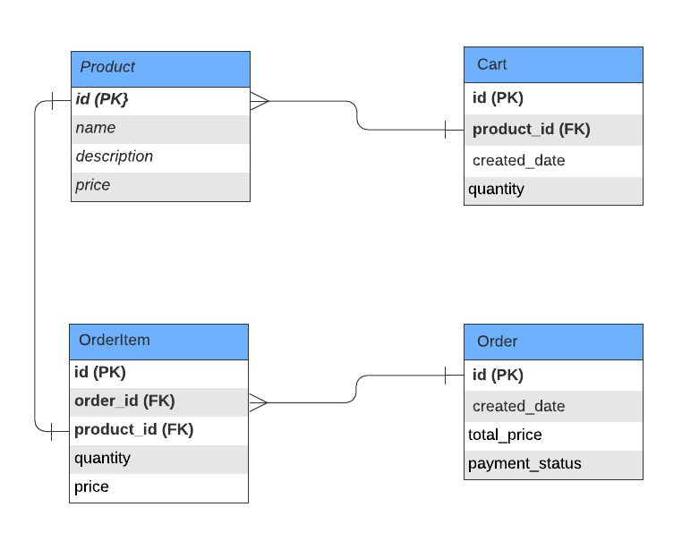

## Assignments for Java Boot Camp
* [Week 1 :: Design and Develop RESTful API with Spring Boot](https://github.com/up1/assignment-java-boot-camp/wiki/Week-01)


## Resources
* [Spring Boot Reference](https://spring.io/projects/spring-boot)
* https://www.baeldung.com/ 
* https://start.spring.io/
* [Git commit message](https://www.conventionalcommits.org/en/v1.0.0/)

## วิธี run
```
$ mvnw clean
$ mvnw compile
$ mvnw package
$ mvnw spring-boot:run
```

## Entity Relationship Diagram



## อธิบายการทำงานของ workflow shopping cart
1. user สามารถ list all product ด้วย API
```
GET /api/products
```
จะได้ response ตามด้านล่างนี้
```json
[
  {
    "id":1,
    "name":"Nike Air Force 1 Low Shoes",
    "description":"represents a modern take on the classic sneaker",
    "price":2400.0
  },
  {
    "id":2,
    "name":"Nike Training Men Shirt",
    "description":"helps you power through workouts with innovative and practical gear",
    "price":600.0
  },
  {
    "id":3,
    "name":"Puma RS-Z BP Men's Shoes",
    "description":"step out in style in the latest edition of the RS-Z",
    "price":2300.0
  },
  {
    "id":4,
    "name":"Puma Football Rise Training t-shirt",
    "description":"t-shirt in black and yellow pop",
    "price":500.0
  }
]
```
2. user สามารถค้นหา product ด้วย API
```
GET /api/products?query=nike
```
โดย API จะ response มาเป็น
````json
[
  {
    "id":1,
    "name":"Nike Air Force 1 Low Shoes",
    "description":"represents a modern take on the classic sneaker",
    "price":2400.0
  },
  {
    "id":2,
    "name":"Nike Training Men Shirt",
    "description":"helps you power through workouts with innovative and practical gear",
    "price":600.0
  }
]
````
3. จากนั้น user สามารถเลือกชนิดของสินค้าและจำนวนที่ต้องการเพื่อทำการเพิ่มเข้าไปในตะกร้าสินค้า ด้วย API

ใส่ `id` ของสินค้าที่ต้องการเพิ่มลงตะกร้า ที่ `productId`

ใส่ `จำนวน` ของสินค้า ที่ `quantity`
```
POST /api/carts
{
  "productId":3,
  "quantity":1
}
```
เมื่อทำการเพิ่มสินค้าลงตะกร้าสำเร็จจะได้รับ response กลับมาดังนี้
```json
{
  "success":true,
  "message":"Added to cart",
  "timestamp":"2022-02-27T18:02:50.667805"
}
```
4. เมื่อทำการเพิ่มสินค้าลงตะกร้าได้ครบตามต้องการแล้วจึงทำการ place order ด้วย API
```
POST /api/orders
```
หากสำเร็จจะได้รับ response กลับมาดังนี้
```json
{
  "success":true,
  "message":"Order has been placed",
  "timestamp":"2022-02-27T18:09:52.833406"
}
```
5. เมื่อทำการตรวจสอบ Orderในระบบด้วย API
```
GET /api/orders
```
จะพบว่า สถานะการจ่ายเงิน `paymentStatue` ยังเป็น `ready to pay`
```json
[
  {
    "id":1,
    "totalPrice":2300.0,
    "paymentStatus":"ready to pay",
    "orderItems":[
      {
        "quantity":1,
        "price":2300.0,
        "product":{
          "id":3,
          "name":"Puma RS-Z BP Men's Shoes",
          "description":"step out in style in the latest edition of the RS-Z",
          "price":2300.0
        }
      }
    ]
  }
]
```
6. จากนั้นดำเนินการชำระเงินด้วย API
```
POST /api/orders/{id}/pay
```
หากสำเร็จจะได้รับ response ตามนี้
```json
{
  "success":true,
  "message":"Order has been paid successfully",
  "timestamp":"2022-02-27T15:33:44.125881"
}
```
7. เมื่อชำระเงินสำเร็จแล้ว เรียกดูสถานะ Order จากระบบด้วย API
```
GET /api/orders/{id}
```
จะได้รับ response ที่มีการยืนยันสถานะการชำระเงิน `paymentStatue` เป็น `paid`
```json
{
  "id":1,
  "totalPrice":2300.0,
  "paymentStatus":"paid",
  "orderItems":[
    {
      "quantity":1,
      "price":2300.0,
      "product":{
        "id":3,
        "name":"Puma RS-Z BP Men's Shoes",
        "description":"step out in style in the latest edition of the RS-Z",
        "price":2300.0
      }
    }
  ]
}
```
